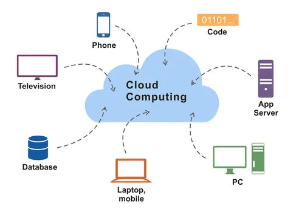

---

# **Cloud Introduction & Cloud Computing Fundamentals**

---

## **1. Introduction to Cloud Computing**

**Definition:**
Cloud computing is a **model for delivering computing resources—servers, storage, databases, networking, software, analytics, and intelligence—over the internet (“the cloud”)**. Instead of owning and managing physical infrastructure, users can **access these resources on-demand** from a cloud provider.

**Formal Definition (NIST):**

> “Cloud computing is a model for enabling convenient, on-demand network access to a shared pool of configurable computing resources (e.g., networks, servers, storage, applications, and services) that can be rapidly provisioned and released with minimal management effort or service provider interaction.”

**Key Idea:**

* Users pay **for what they use**.
* Resources are **scalable, elastic, and remotely managed**.
* Eliminates the need for owning physical infrastructure.

---

## **2. Characteristics of Cloud Computing (Fundamentals)**

1. **On-Demand Self-Service:**

   * Users can automatically **provision computing resources** as needed without human intervention.

2. **Broad Network Access:**

   * Services are accessible over the internet via **laptops, mobiles, tablets, or desktops**.

3. **Resource Pooling:**

   * Cloud providers **share physical and virtual resources** among multiple users (multi-tenancy).

4. **Rapid Elasticity / Scalability:**

   * Resources can **scale up or down** quickly to meet demand.

5. **Measured Service / Pay-as-you-go:**

   * Users are charged based on **resource usage** (CPU hours, storage GB, etc.).

6. **Managed by Provider:**

   * Cloud provider handles **maintenance, security, and upgrades**.

---

## **3. Types of Cloud (Deployment Models)**

| Type                | Description                                            | Example                                   |
| ------------------- | ------------------------------------------------------ | ----------------------------------------- |
| **Public Cloud**    | Services offered over the internet to multiple users   | AWS, Microsoft Azure, Google Cloud        |
| **Private Cloud**   | Dedicated infrastructure for a single organization     | On-premises VMware cloud                  |
| **Hybrid Cloud**    | Combination of public and private clouds               | Company using Azure + private data center |
| **Community Cloud** | Shared cloud for a specific group with common concerns | Government or healthcare clouds           |

---

## **4. Cloud Computing Services (Service Models)**

| Model                                  | What it Provides                                             | Example                                        |
| -------------------------------------- | ------------------------------------------------------------ | ---------------------------------------------- |
| **IaaS (Infrastructure as a Service)** | Virtualized computing resources (servers, storage, networks) | AWS EC2, Google Compute Engine                 |
| **PaaS (Platform as a Service)**       | Development platform with OS, middleware, and runtime        | Microsoft Azure App Service, Google App Engine |
| **SaaS (Software as a Service)**       | Ready-to-use applications over the internet                  | Gmail, Salesforce, Dropbox                     |

---

## **5. Benefits of Cloud Computing**

1. **Cost Savings:** No upfront infrastructure investment.
2. **Scalability:** Instantly increase/decrease resources.
3. **Accessibility:** Access from anywhere, anytime.
4. **Disaster Recovery:** Backup and recovery solutions.
5. **Automatic Updates:** Providers manage software and security updates.
6. **Focus on Core Business:** Less IT maintenance burden.

---

## **6. Challenges / Issues in Cloud Computing**

1. **Data Security & Privacy:** Risk of unauthorized access or breaches.
2. **Downtime / Availability:** Service interruptions can impact business.
3. **Vendor Lock-in:** Moving data between providers can be complex.
4. **Compliance & Legal Issues:** Data may be stored in different countries.
5. **Integration Complexity:** Legacy systems may not integrate easily.
6. **Performance:** Shared resources may lead to latency.

---

## **7. Usage Scenarios and Applications**

1. **Enterprise Applications:** CRM, ERP, HR management.
2. **Storage & Backup:** Online file storage and disaster recovery.
3. **Big Data Analytics:** Processing large datasets without owning infrastructure.
4. **Web Hosting:** Websites and e-commerce platforms.
5. **Development & Testing:** Rapid provisioning for software testing.
6. **Mobile Apps & IoT:** Cloud provides backend infrastructure for apps and devices.

---

## **8. Business Models Around Cloud Computing**

1. **Subscription-Based:** Pay monthly or yearly for services (e.g., Office 365).
2. **Pay-As-You-Go:** Pay based on actual usage (e.g., AWS EC2 billing per hour).
3. **Freemium:** Basic services free, advanced features paid (e.g., Dropbox).

---

## **9. Major Players in Cloud Computing**

| Provider                        | Type           | Key Offerings                  |
| ------------------------------- | -------------- | ------------------------------ |
| **Amazon AWS**                  | Public Cloud   | IaaS, PaaS, SaaS               |
| **Microsoft Azure**             | Public Cloud   | IaaS, PaaS, SaaS               |
| **Google Cloud Platform (GCP)** | Public Cloud   | Big Data, AI, Compute Services |
| **IBM Cloud**                   | Public/Hybrid  | AI, Blockchain, IaaS           |
| **Oracle Cloud**                | Public/Private | Databases, SaaS                |

---

## **10. Summary**

* **Cloud Computing** is a **delivery model for computing services over the internet**.
* **Key Characteristics:** On-demand, scalable, accessible, resource pooling, pay-as-you-go.
* **Deployment Models:** Public, Private, Hybrid, Community.
* **Service Models:** IaaS, PaaS, SaaS.
* **Benefits:** Cost saving, scalability, accessibility, disaster recovery.
* **Challenges:** Security, downtime, integration, vendor lock-in.
* **Applications:** Enterprise apps, web hosting, storage, analytics.

---

💡 **Analogy for Memory:**
Think of the cloud like **renting a utility (electricity or water) instead of generating it yourself**:

* You **pay only for what you use**.
* The provider maintains everything.
* You can **scale up instantly** if demand rises.

---

