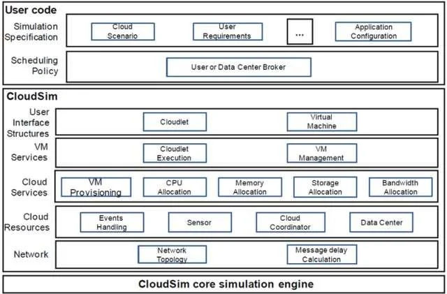

---

# **CloudSim – Cloud Simulation Framework**

---

## **1. Introduction**

**Definition:**
**CloudSim** is a **framework for modeling and simulating cloud computing environments and services**. It allows researchers and students to **study, test, and evaluate cloud computing policies, algorithms, and resource management techniques** without using real cloud infrastructure.

**Key Idea:**
CloudSim **simulates cloud infrastructure, services, and workloads**, helping developers experiment **before deploying to real clouds**.

---

## **2. Purpose of CloudSim**

* Simulate cloud infrastructure and services in a **controlled environment**.
* Evaluate **resource provisioning, scheduling, and allocation policies**.
* Test **cost models and energy-efficient strategies**.
* Study **scalability, performance, and reliability** of cloud applications.

**Why use CloudSim?**

* Real cloud testing is **expensive**.
* CloudSim allows **repeatable experiments**.
* Helps in **research and education** on cloud technologies.

---

## **3. Key Features of CloudSim**

1. **Modeling of Data Centers:**

   * Supports multiple **data centers with heterogeneous hardware**.
2. **Virtual Machines (VMs):**

   * Simulates VM creation, allocation, and migration.
3. **Cloudlets:**

   * Represents **tasks or applications** executed on VMs.
4. **Resource Provisioning Policies:**

   * Simulate policies like **time-shared, space-shared, and priority-based scheduling**.
5. **Cost Modeling:**

   * Simulate **costs for CPU, memory, storage, and bandwidth**.
6. **Support for Federated Clouds:**

   * Multiple cloud providers can be modeled together.
7. **Extensibility:**

   * Researchers can add **new scheduling policies or power-aware models**.

---

## **4. Architecture of CloudSim**

```text
+------------------------------------------------------+
| User Code / Cloud Applications                       |
| (Cloudlets)                                         |
+------------------------------------------------------+
                  |
                  v
+------------------------------------------------------+
| CloudSim Simulation Core                            |
| - Handles event management                          |
| - Manages data centers, VMs, and scheduling        |
+------------------------------------------------------+
                  |
                  v
+------------------------------------------------------+
| Virtualized Cloud Resources                          |
| - Hosts                                              |
| - VMs                                               |
| - Data Center Infrastructure                        |
+------------------------------------------------------+
                  |
                  v
+------------------------------------------------------+
| Physical Infrastructure                               |
| - CPUs, RAM, Storage, Bandwidth                     |
+------------------------------------------------------+
```

**Explanation:**

1. **Physical Infrastructure:** Real resources like CPU, RAM, and network are modeled.
2. **Virtualized Resources:** VMs are created and allocated to tasks (cloudlets).
3. **Simulation Core:** Manages scheduling, resource allocation, and events.
4. **User Applications (Cloudlets):** Tasks submitted by users that are executed on VMs.

---

## **5. Components of CloudSim**

| Component                | Description                                               |
| ------------------------ | --------------------------------------------------------- |
| **Data Center**          | Represents cloud infrastructure with hosts (servers)      |
| **Host**                 | Physical server with CPU, RAM, storage                    |
| **Virtual Machine (VM)** | Virtualized resource allocated to cloudlets               |
| **Cloudlet**             | Task or application submitted for execution               |
| **Broker**               | Mediates between users and cloud resources; allocates VMs |
| **Provisioner**          | Handles allocation policies for CPU, RAM, and bandwidth   |

---

## **6. Advantages of CloudSim**

* **Cost-effective:** No need to use real cloud resources.
* **Flexible:** Supports multiple cloud scenarios, policies, and workloads.
* **Scalable:** Can simulate large cloud environments.
* **Educational & Research Tool:** Widely used in universities for cloud computing research.
* **Repeatable Experiments:** Run the same scenario multiple times to compare policies.

---

## **7. Limitations of CloudSim**

* Does not simulate **real network conditions** in detail.
* Limited support for **real-time applications**.
* **Energy consumption models** may not be very detailed for highly accurate studies.

---

## **8. Applications of CloudSim**

1. **Research:**

   * Compare **scheduling algorithms, load balancing policies, and energy efficiency models**.
2. **Education:**

   * Teach students about **cloud infrastructure, virtualization, and resource allocation**.
3. **Prototyping:**

   * Test cloud applications before deployment to real platforms like AWS or Azure.

---

## **9. Example Workflow in CloudSim**

1. **Create Data Centers** with hosts and physical resources.
2. **Define Virtual Machines (VMs)** with CPU, RAM, and storage.
3. **Create Cloudlets** representing tasks.
4. **Submit Cloudlets to VMs** via a broker.
5. **Simulate execution** and collect results (time, cost, resource utilization).
6. **Analyze results** to evaluate scheduling, allocation, or cost policies.

---

## **10. Summary**

* **CloudSim** is a **simulation toolkit for cloud computing**.
* Helps in **modeling, testing, and evaluating cloud infrastructure, applications, and policies** without real cloud deployment.
* Widely used in **research, education, and prototyping**.
* **Core concepts:** Data Centers, Hosts, VMs, Cloudlets, Brokers, and Provisioners.

---

💡 **Analogy:**
Think of CloudSim as a **“flight simulator for cloud computing.”** You can **test flight plans (applications, scheduling, policies)** in a **safe virtual environment** before actually flying (deploying on real cloud infrastructure).

---

If you want, I can also **draw a neat diagram showing CloudSim architecture and workflow**, which is **super useful for exams**.

Do you want me to make that diagram?

