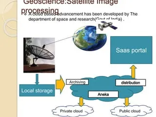

---

# **Satellite Image Processing Using Cloud Computing**

Satellite image processing is the **analysis, interpretation, and manipulation of images captured by satellites**. These images are often used for:

* Earth observation (land use, urban development, agriculture)
* Weather forecasting and climate monitoring
* Disaster management (floods, wildfires, earthquakes)
* Military and surveillance applications

Modern satellites generate **massive amounts of data**. Cloud computing provides the **infrastructure, storage, and processing power** to handle this efficiently.

---

## **1. Why Cloud Computing is Important for Satellite Image Processing**

### **Challenges with Traditional Systems**

* Satellite images are **huge in size** (terabytes per day for high-resolution satellites)
* **Complex processing algorithms** (e.g., image classification, change detection) require high computing power
* Storing and sharing large datasets locally is **expensive and slow**

### **Cloud Advantages**

1. **Scalability** – Can process terabytes or petabytes of data on-demand
2. **High-performance computing** – Parallel processing with clusters and GPUs
3. **Storage** – Low-cost, elastic storage solutions for raw and processed images
4. **Accessibility** – Images and processing tools can be accessed globally
5. **Collaboration** – Researchers and organizations can work on the same datasets simultaneously

---

## **2. Workflow of Satellite Image Processing in the Cloud**

The workflow generally involves **these steps**:

### **Step 1: Data Acquisition**

* Satellites capture images using sensors (optical, infrared, radar)
* Data is transmitted to **ground stations**
* Cloud platforms ingest data directly from satellites (e.g., via APIs or data feeds)

**Example**: Sentinel satellites provide open-access data to cloud platforms like AWS and Google Cloud.

---

### **Step 2: Data Storage**

* Cloud provides **elastic storage** for raw satellite images:

  * Object storage (AWS S3, Google Cloud Storage, Azure Blob Storage)
* Metadata (time, location, sensor type) is stored in databases for **easy retrieval**

**Advantages**:

* No need for expensive local storage
* Easy access for multiple users

---

### **Step 3: Preprocessing**

* Raw satellite images often need **corrections** before analysis:

  * Radiometric correction (sensor errors)
  * Geometric correction (aligning images to coordinates)
  * Noise removal

**Cloud Role**:

* Preprocessing is **computationally intensive**, especially for high-resolution images
* Distributed computing frameworks like **Apache Spark** on cloud clusters are used

---

### **Step 4: Image Processing and Analysis**

* Common tasks:

  * **Classification**: Identifying land cover types (forest, water, urban)
  * **Change Detection**: Detecting changes over time (deforestation, urban growth)
  * **Feature Extraction**: Roads, buildings, water bodies
* Techniques involve **machine learning, deep learning, and GIS algorithms**

**Cloud Role**:

* Provides **GPU and TPU acceleration** for AI algorithms
* Enables **parallel processing** of thousands of images simultaneously
* Examples of frameworks: TensorFlow, PyTorch, Google Earth Engine

---

### **Step 5: Visualization**

* Processed images need to be visualized for decision-making
* Cloud platforms provide **web-based dashboards and mapping tools**
* Supports interactive maps, 3D visualization, and overlays with other GIS data

**Example Tools**:

* Google Earth Engine
* AWS Open Data Program with Amazon SageMaker
* Azure Maps

---

### **Step 6: Distribution and Sharing**

* Cloud allows sharing of processed images with **researchers, governments, or the public**
* Supports APIs for automated access and integration with other systems

**Example**: NASA Earthdata provides cloud-hosted satellite data for global access

---

## **3. Benefits of Using Cloud for Satellite Image Processing**

| **Benefit**         | **Explanation**                                              |
| ------------------- | ------------------------------------------------------------ |
| Scalability         | Can handle huge datasets dynamically                         |
| Cost Efficiency     | Pay-per-use model reduces hardware investment                |
| Speed               | Parallel and distributed processing reduces computation time |
| Accessibility       | Global access to data and tools                              |
| Collaboration       | Multiple users can process and analyze the same data         |
| Integration with AI | Cloud GPUs/TPUs accelerate AI-based analysis                 |
| Disaster Resilience | Data is stored in multiple regions to prevent loss           |

---

## **4. Challenges**

| **Challenge**      | **Explanation**                                                      |
| ------------------ | -------------------------------------------------------------------- |
| Data Transfer      | Uploading terabytes of satellite data can be slow                    |
| Security & Privacy | Sensitive satellite imagery needs encryption and access control      |
| Cost Management    | Large-scale processing and storage can be expensive if not optimized |
| Latency            | Real-time applications may require edge computing integration        |
| Complexity         | Requires expertise in cloud computing, GIS, and remote sensing       |

---

## **5. Real-World Examples**

1. **Google Earth Engine**

   * Hosts petabytes of satellite imagery
   * Provides cloud-based processing tools for environmental monitoring

2. **Amazon Web Services (AWS) Open Data Program**

   * Hosts Landsat, Sentinel, and MODIS satellite data
   * Enables AI and analytics on large-scale satellite datasets

3. **Microsoft Planetary Computer (Azure)**

   * Provides datasets and cloud tools for Earth observation and environmental research

---

## **6. Summary Diagram (Text Version)**

```id="satcloud"
Satellite Image Processing Workflow Using Cloud

Data Acquisition
   ↓
Data Storage (Cloud Storage)
   ↓
Preprocessing (Noise removal, Geometric correction) 
   ↓
Image Processing & Analysis (Classification, ML/DL)
   ↓
Visualization (Maps, Dashboards)
   ↓
Distribution & Sharing (APIs, Collaboration)
```

---

### **Key Points for Exams**

* Cloud computing **enables storage, computation, and accessibility** for massive satellite datasets
* Key techniques: **Distributed computing, AI/ML, GIS tools**
* Real-world platforms: **Google Earth Engine, AWS Open Data, Azure Planetary Computer**
* Main benefits: **scalability, cost efficiency, speed, collaboration**

---

If you want, I can also make a **visual diagram showing satellite image processing in the cloud with all steps, tools, and benefits**—it’s very easy to memorize for exams.

Do you want me to make that diagram?
